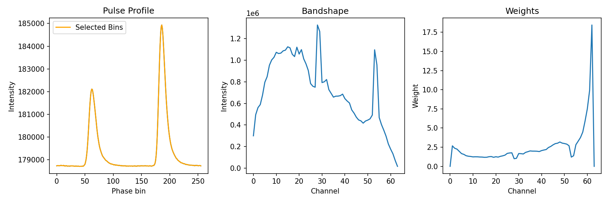
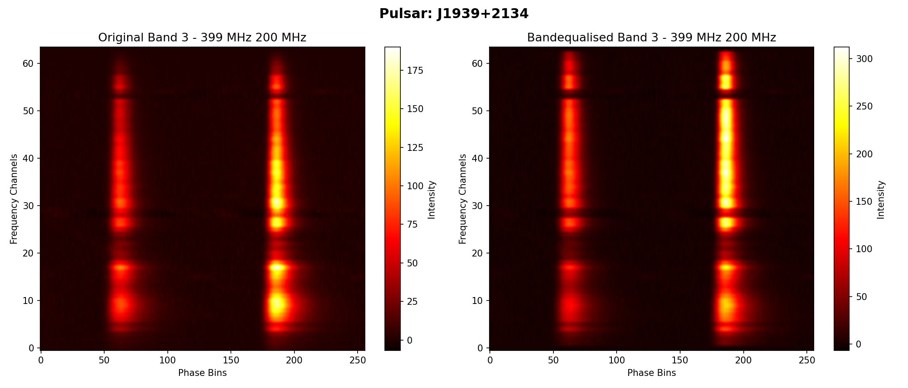

# Bandshape Equalisation for uGMRT Pulsar Archives

A command-line tool for performing bandshape equalisation on pulsar FITS archives observed with the **uGMRT** (upgraded Giant Metrewave Radio Telescope). It flattens the frequency response of an observation by computing per-channel weights from the off-pulse signal and applying them across the archive.

**Author:** Churchil Dwivedi, Avinash Kumar Paladi  
**Email:** churchil.gw4@gmail.com, avinashkumarpaladi@gmail.com

---

## What it does

1. Loads a PSRCHIVE-format FITS archive and dedisperses it.
2. Sums the data over a user-defined off-pulse phase-bin window to get the per-channel bandshape.
3. Computes equalisation weights (`max(bandshape) / bandshape`) and masks edge channels and channels with very low signal (< 1% of peak).
4. Applies those weights channel-by-channel and saves a new equalised archive.
5. Produces two diagnostic plots:
   - **`*.diagnostic.png`** — pulse profile with selected window, bandshape, and computed weights.
   - **`*.comparison.png`** — side-by-side frequency–phase waterfall of the original vs. equalised archive.

---

## Requirements

| Dependency | Notes |
|---|---|
| Python ≥ 3.9 | Uses `str.removesuffix` |
| [PSRCHIVE](http://psrchive.sourceforge.net/) | Must be compiled with Python bindings |
| NumPy | `pip install numpy` |
| Matplotlib | `pip install matplotlib` |

---

## Installation

```bash
git clone https://github.com/AvinashKumarPaladi/ugmrt-bandshape-equalisation.git
cd bandshape-equalisation
```

or 
```bash
wget https://github.com/AvinashKumarPaladi/ugmrt-bandshape-equalisation/blob/main/bandshape_equalisation.py
```
No additional installation step is needed — the script runs directly.

---

## Usage

```bash
python3 bandshape_equalisation.py <FITS-file> [--sbin SBIN] [--ebin EBIN] [--output OUTPUT]
```

### Arguments

| Argument | Type | Description |
|---|---|---|
| `FITS-file` | positional (required) | Input PSRCHIVE FITS archive |
| `--sbin SBIN` | optional int | Start phase bin of the off-pulse window (default: `0`) |
| `--ebin EBIN` | optional int | End phase bin of the off-pulse window (default: `nbin`) |
| `--output OUTPUT` | optional str | Output filename (default: `<input>.beq.fits`) |

### Get help

```bash
python3 bandshape_equalisation.py --help
```

---

## Examples

**Minimal — auto-detect pulse window and output name:**
```bash
python3 bandshape_equalisation.py J0437+4715_Band3.fits
# Output: J0437+4715_Band3.beq.fits
```

**Specify off-pulse phase bins:**
```bash
python3 bandshape_equalisation.py J0437+4715_Band3.fits --sbin 100 --ebin 200
```

**Full control — specify all arguments:**
```bash
python3 bandshape_equalisation.py J0437+4715_Band3.fits \
    --sbin 100 \
    --ebin 200 \
    --output J0437.Band3.beq.fits
```

---

## Example Output

### Diagnostic Plot


*Pulse profile (with selected bins highlighted), per-channel bandshape, and computed equalisation weights for PSR J1939+2134 observed at Band 3 (399 MHz, 200 MHz bandwidth).*

### Before / After Comparison


*Left: original archive showing uneven frequency response. Right: bandequalised archive with flattened bandshape. The pulse from PSR J1939+2134 is clearly visible across all channels after equalisation.*

---

## Output files

For an input file `obs.fits`, the script produces:

| File | Description |
|---|---|
| `obs.beq.fits` | Bandshape-equalised PSRCHIVE archive |
| `obs.beq.diagnostic.png` | Pulse profile, bandshape, and weight plots |
| `obs.beq.comparison.png` | Before/after frequency–phase waterfall |

---

## uGMRT Band Definitions

The script identifies the observing band from the archive's central frequency:

| Band | Frequency Range |
|---|---|
| Band 2 | 120 – 250 MHz |
| Band 3 | 250 – 500 MHz |
| Band 4 | 550 – 850 MHz |
| Band 5 | 1000 – 1460 MHz |

A warning is printed if the telescope is not GMRT/uGMRT or if the frequency falls outside all known bands.

---

## How the weights are computed

```
bandshape[ichan] = sum of data over (sub-integrations, polarisations, off-pulse bins)

weight[ichan] = max(bandshape) / bandshape[ichan]
```

Channels are zero-weighted if they are:
- The first or last channel (edge RFI).
- Below 1% of the peak bandshape value (dead/noisy channels).

---

## Notes

- By default, plots are saved as PNG files (non-interactive `Agg` backend). To get interactive pop-up windows, change `matplotlib.use('Agg')` to `matplotlib.use('TkAgg')` or `matplotlib.use('Qt5Agg')` at the top of the script.
- The script currently processes the **first sub-integration** when applying weights (`get_Integration(0)`). For multi-subintegration archives, extend the loop over all integrations as needed.
- Only **total intensity** (polarisation 0) is used for weight computation.

---

## License

MIT License. See `LICENSE` for details.

---

## Contact

Churchil Dwivedi — churchil.gw4@gmail.com
Avinash Kumar Paladi — avinashkumarpaladi@gmail.com
